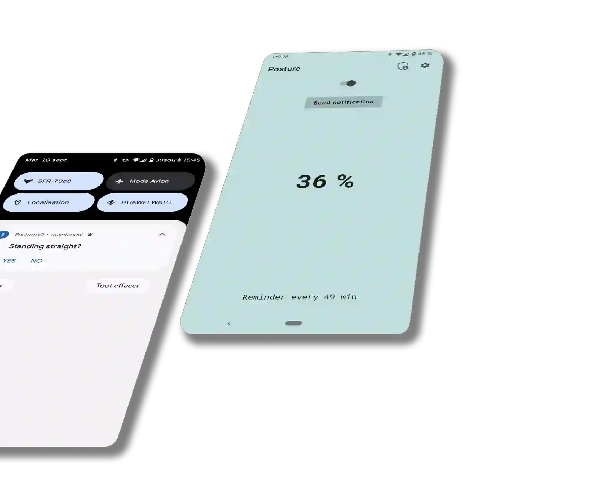

<h1 align="left">Posture</h1>

Last updated on 5 Sep 2022

<h4>With an increasingly sedentary lifestyle, our backs tend to slouch in front of our computer screens. Posture reminds us to stand straight while adapting the frequency of notifications according to our score!</h4>

___

## Technical features

- Language : **Kotlin**
- **MVVM** architecture
- **JetPack Compose** for UI
- Dependency injection with **Dagger.Hilt**
- Periodic **Notifications** via **WorkManager**
- Preferences storage with **DataStore**
- Data persistence on SQLite database with **Room**
